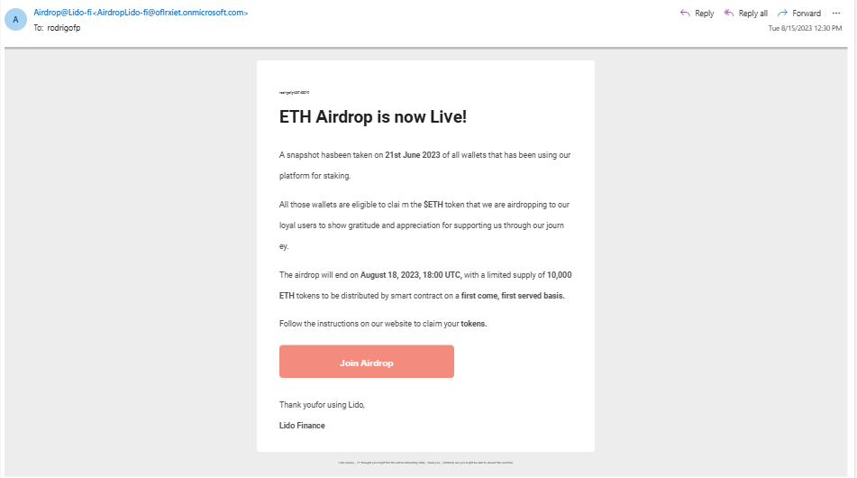
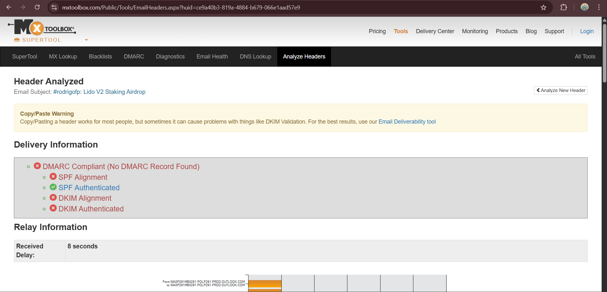

# Phishing Email Analysis: Fake Lido Finance Airdrop

## Email Summary
This email pretends to be from **Lido Finance** offering a fake cryptocurrency airdrop to steal user credentials.

| Detail | Value |
|--------|-------|
| **From** | `Airdrop@Lido-fi <AirdropLido-fi@oflrxiet.onmicrosoft.com>` |
| **To** | `rodrigofp` |
| **Subject** | `#rodrigofp: Lido V2 Staking Airdrop` |
| **Date** | `August 15, 2023, 12:30 PM` |

**Verdict: PHISHING EMAIL** ⚠

---

## Why This is Phishing

### Content Red Flags
- **Fake Identity**: Claims to be "Lido Finance" but uses a Microsoft email domain
- **Creates Urgency**: "Airdrop will end on August 18" to pressure quick action  
- **Too Good to be True**: Promises free "10,000 ETH tokens"
- **Suspicious Button**: "Join Airdrop" button leads to malicious website
- **Poor Grammar**: Contains spelling errors and awkward phrasing

### Technical Problems (Header Analysis)

| Security Check | Result | What This Means |
|----------------|--------|-----------------|
| **DMARC** | ❌ Failed | No protection against fake emails |
| **DKIM** | ❌ Failed | Email can't be verified as authentic |
| **SPF** | ✅ Passed | Email came from Microsoft servers (but that doesn't make it safe) |
| **Domain** | ❌ Suspicious | Uses `oflrxiet.onmicrosoft.com` instead of official Lido domain |

### Email Route
The email traveled through Microsoft's servers but originated from a fake domain trying to impersonate Lido Finance.

---

## Screenshots

*The fake Lido airdrop email received in Outlook*

  
*MXToolbox analysis showing authentication failures*

---

## How to Stay Safe

### Don't:
- Click the "Join Airdrop" button or any links
- Enter your wallet information on suspicious websites
- Trust emails about free cryptocurrency without verification

### Do:
- Check official Lido website (lido.fi) for real announcements
- Verify sender's actual email domain (not just the display name)
- Report this email as phishing to your email provider
- Delete the email immediately

---

## Key Takeaways

1. **Real companies don't email random airdrops** - Legitimate projects announce through official channels
2. **Check the actual email address** - This uses Microsoft's domain, not Lido's official domain
3. **Security checks failed** - No DMARC or DKIM protection means it's likely fake
4. **When in doubt, don't click** - Always verify through official websites first

